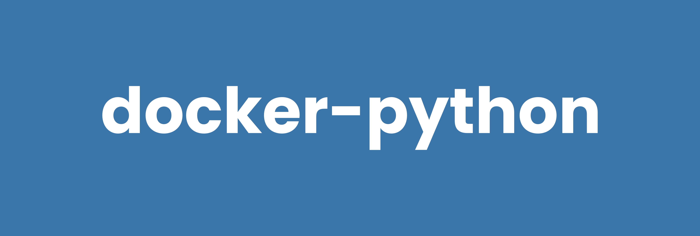

# docker-python



[](https://github.com/ragedunicorn/docker-python/actions/workflows/docker_release.yml)
[](https://github.com/ragedunicorn/docker-python/actions/workflows/test.yml)


> Minimal Docker Alpine image with Python and pip.


## Overview

This Docker image provides a minimal Python installation built on Alpine Linux. It includes only Python and pip, allowing you to install exactly what you need for your specific use case.

## Features

- **Ultra-small footprint**: ~50MB image using Alpine Linux
- **Python 3**: Latest Python 3 version from Alpine packages
- **Minimal installation**: Only Python and pip included
- **Non-root user**: Enhanced security with dedicated python user
- **Volume mounting**: Easy code and data access through `/app`
- **Customizable**: Install only the packages you need

## Quick Start

```bash
# Run Python interactively
docker compose run --rm python

# Run a Python script
docker compose run --rm python script.py

# Run the hello world example
cd examples && docker compose run --rm hello-world

# Or run directly with Docker
docker run -it --rm ragedunicorn/python:latest
docker run -v $(pwd):/app ragedunicorn/python:latest script.py
```

## Basic Usage

```bash
# Run with Python options
docker compose run --rm python [python-options]

# Execute Python code directly
docker compose run --rm python -c "print('Hello, World!')"

# Install packages and run script
docker compose run --rm python /bin/sh -c "pip install requests && python script.py"

# Or use Docker directly
docker run -v $(pwd):/app ragedunicorn/python:latest [python-options]
docker run --rm ragedunicorn/python:latest -c "print('Hello, World!')"
```

## Examples

See the [examples](examples/) directory for a simple hello-world example.

## Building Custom Images

To create a custom image with your required packages:

```dockerfile
FROM ragedunicorn/python:latest

# Install Python packages
USER root
RUN pip install requests numpy pandas
USER python

# Copy your application
WORKDIR /app
COPY . .

CMD ["python", "app.py"]
```

## Versioning

**Format:** `{python_major_version}-alpine{alpine_version}-{build_number}`

Examples:
- `latest` - Most recent stable release
- `3-alpine3.22.1-1` - Python 3 on Alpine 3.22.1, build 1

## Development

For local development and building from source, use the development compose file:

```bash
# Build the image locally
docker compose -f docker-compose.dev.yml build

# Run with local build
docker compose -f docker-compose.dev.yml run --rm python script.py
```

## Documentation

- [Development Guide](DEVELOPMENT.md) - Building and contributing
- [Testing Guide](TEST.md) - Running tests
- [Release Process](RELEASE.md) - Versioning and releases
- [Examples](examples/) - Simple Python examples

## Links

- [Python Documentation](https://docs.python.org/)
- [Alpine Linux](https://www.alpinelinux.org/)
- [Docker Hub](https://hub.docker.com/r/ragedunicorn/python)

# License

MIT License

Copyright (c) 2025 Michael Wiesendanger

Permission is hereby granted, free of charge, to any person obtaining a copy
of this software and associated documentation files (the "Software"), to deal
in the Software without restriction, including without limitation the rights
to use, copy, modify, merge, publish, distribute, sublicense, and/or sell
copies of the Software, and to permit persons to whom the Software is
furnished to do so, subject to the following conditions:

The above copyright notice and this permission notice shall be included in all
copies or substantial portions of the Software.

THE SOFTWARE IS PROVIDED "AS IS", WITHOUT WARRANTY OF ANY KIND, EXPRESS OR
IMPLIED, INCLUDING BUT NOT LIMITED TO THE WARRANTIES OF MERCHANTABILITY,
FITNESS FOR A PARTICULAR PURPOSE AND NONINFRINGEMENT. IN NO EVENT SHALL THE
AUTHORS OR COPYRIGHT HOLDERS BE LIABLE FOR ANY CLAIM, DAMAGES OR OTHER
LIABILITY, WHETHER IN AN ACTION OF CONTRACT, TORT OR OTHERWISE, ARISING FROM,
OUT OF OR IN CONNECTION WITH THE SOFTWARE OR THE USE OR OTHER DEALINGS IN THE
SOFTWARE.

